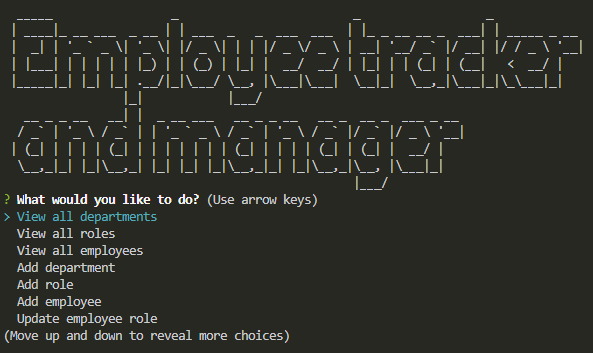

# Employee-tracker-and-manager


## Description

This project supports users, such as business owners, to be able to easily view and interact with databases to keep track of and manage their workplaces, such as viewing all their departments, roles within departments, salaries, employees, and more.

When a user starts the application using `npm start` in the command-line, the user is brought to the "Employee tracker and manager", which provides a list of actions the user can take. These includes viewing all departments, roles and employees; adding new departments, roles, and employees; updating managers or roles of employees; and more.

Once the user is finished using the "Employee tracker and manager", they can select "Quit", which will end the connection to the database.

> A walkthrough video of the application functionality can be viewed here: https://drive.google.com/file/d/1bxK_2gYiHt87G6YDQmd9FG5ZiQBp_HmY/view?usp=sharing

## Table of contents

- [User story](#user-story)
- [Acceptance criteria](#acceptance-criteria)
- [Technologies used/built with](#technologies-usedbuilt-with)
- [Installation](#installation)
- [Usage](#usage)
- [Credits](#credits)
- [License](#license)

## User story

```
AS A business owner
I WANT to be able to view and manage the departments, roles, and employees in my company
SO THAT I can organize and plan my business
```

## Acceptance criteria

```
GIVEN a command-line application that accepts user input
WHEN I start the application
THEN I am presented with the following options: view all departments, view all roles, view all employees, add a department, add a role, add an employee, and update an employee role
WHEN I choose to view all departments
THEN I am presented with a formatted table showing department names and department ids
WHEN I choose to view all roles
THEN I am presented with the job title, role id, the department that role belongs to, and the salary for that role
WHEN I choose to view all employees
THEN I am presented with a formatted table showing employee data, including employee ids, first names, last names, job titles, departments, salaries, and managers that the employees report to
WHEN I choose to add a department
THEN I am prompted to enter the name of the department and that department is added to the database
WHEN I choose to add a role
THEN I am prompted to enter the name, salary, and department for the role and that role is added to the database
WHEN I choose to add an employee
THEN I am prompted to enter the employee’s first name, last name, role, and manager, and that employee is added to the database
WHEN I choose to update an employee role
THEN I am prompted to select an employee to update and their new role and this information is updated in the database 
```


## Technologies used/built with

This project used the following technologies to build it:

- Node.js
- [inquirer NPM package](https://www.npmjs.com/package/inquirer)
- [MySQL2 NPM package](https://www.npmjs.com/package/mysql2)
- [console.table NPM package](https://www.npmjs.com/package/console.table)
- [figlet NPM package](https://www.npmjs.com/package/figlet)
- [dotenv NPM package](https://www.npmjs.com/package/dotenv)
- JavaScript


## Installation

1. Clone the repo (HTTPS: `git clone https://github.com/CharDige/Employee-tracker-and-manager.git` or SSH: `git clone git@github.com:CharDige/Employee-tracker-and-manager.git`)

2. Install all NPM packages by running `npm i` or, if you wish to install each NPM package individually:

- Install inquirer NPM package `npm install inquirer`

- Install MySQL2 NPM package `npm install mysql2`

- Install console.table NPM package `npm install console.table`

- Install figlet NPM package `npm install figlet`

- Install dotenv NPM package `npm install dotenv`

## Usage

Below, you will find a walkthrough video and screenshots on how to use this application.

### Walkthrough video

To view how this employee tracker and manager application works, you can watch [this walkthrough video](https://drive.google.com/file/d/1bxK_2gYiHt87G6YDQmd9FG5ZiQBp_HmY/view?usp=sharing)

### Screenshots

After the installation process has been undertaken, the user can begin the application by entering `npm start` into the command-line.

The user will be presented with a number of choices to select from, including viewing all departments, roles and employees; adding new departments, roles, and employees; updating managers or roles of employees; and more.



When the user selects `View all departments`, `View all roles` or `View all employees`, they will be presented with a table that will list all the departments, roles and employees within the database.

**View all departments**


**View all roles**


**View all employees**


When the user selects any of the other choices (except for `Quit`), they will be presented with either one or multiple prompts in the command-line for information. This could be inputting information for adding a new employee or selecting a department to remove, for example.

A couple of these options will result in a table being presented, such as `View employees by manager`, `View employees by department` and `View total budget of a department`. The rest receive a notification confirming that data has been updated.

**Add department**


**Add role**


**Add employee**


**Update employee role**


**Update employee manager**


**View employees by manager**


**View employees by department**


**View total budget of a department**


**Remove department**


**Remove role**


**Remove employee**


Once the user is finished using the employee tracker and manager, they can select `quit`, which ends the connection with the database. The user will be presented with a line that thanks them for using the application to notify them that they have quit the application.


## Credits

Here's a list of resources I'd like to credit that really helped with the development of this application:

- [npm - Node MySQL2](https://www.npmjs.com/package/mysql2)
- [npm - Inquirer.js](https://www.npmjs.com/package/inquirer)
- [npm - console.table](https://www.npmjs.com/package/console.table)
- [npm - dotenv](https://www.npmjs.com/package/dotenv)
- [npm - figlet](https://www.npmjs.com/package/figlet)
- [MySQLTUTORIAL - MySQL DECIMAL Data Type](https://www.mysqltutorial.org/mysql-decimal/)
- [CodingSight - How to Create a Table with Multiple Foreign Keys and Not Get Confused](https://codingsight.com/how-to-create-table-with-multiple-foreign-keys-and-not-get-confused/)
- [W3 Schools - MySQL Joins](https://www.w3schools.com/mysql/mysql_join.asp)
- [LearnSQL - An Illustrated Guide to the SQL Self Join](https://learnsql.com/blog/illustrated-guide-sql-self-join/)
- [LearnSQL - What Is a Self Join in SQL? An Explanation With Seven Examples](https://learnsql.com/blog/what-is-self-join-sql/)
- [W3 Schools - SQL INSERT INTO Statement](https://www.w3schools.com/sql/sql_insert.asp)
- [W3 Schools - SQL UPDATE Statement](https://www.w3schools.com/sql/sql_update.asp)
- [simplernerd - How to Combine Columns Values Into a New Column in MySQL](https://simplernerd.com/sql-combine-columns/)
- [Stack Overflow - MySQL combine two columns into one column](https://stackoverflow.com/questions/22739841/mysql-combine-two-columns-into-one-column)
- [MySQLTUTORIAL - Connecting to the MySQL Database Server from Node.js](https://www.mysqltutorial.org/mysql-nodejs/connect/)
- [W3 Schools - SQL UPDATE Statement](https://www.w3schools.com/sql/sql_update.asp)
- [Guru99 - MySQL IS NULL & IS NOT NULL Tutorial with EXAMPLES](https://www.guru99.com/null.html)
- [W3 Schools - MySQL DELETE Statement](https://www.w3schools.com/mysql/mysql_delete.asp)

## License

[MIT License - Copyright (C) 2022 Charlotte Dige](./LICENSE)